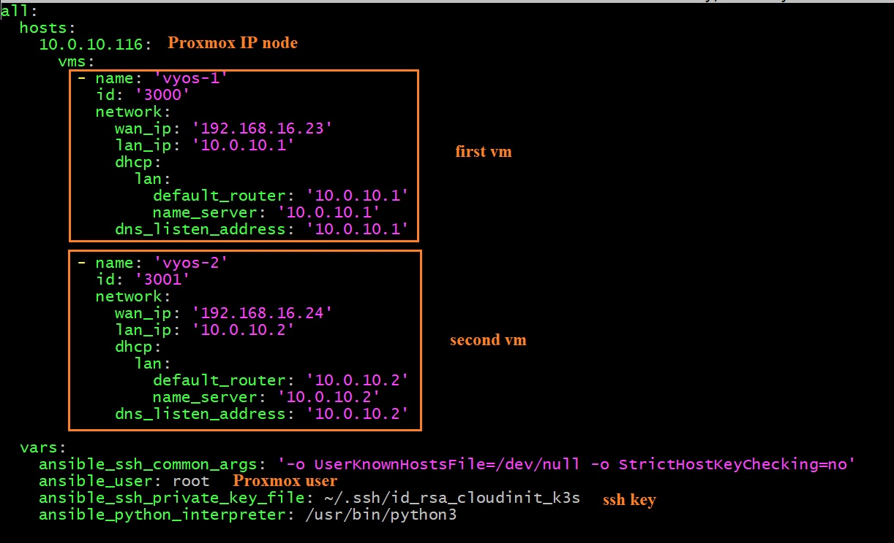

# Create Vyos VMs on ***<font color="green">Proxmox</font>*** node via Ansible playbooks
  
  These ansible playbooks create `vyos` VMs on Proxmox node with certain configured network settings. Also using playbooks you can remove, start or stop them.

## Prerequisites
  ### 1. Install Ansible on `k3s-config` host. We will run ansible playbooks on it.
  ```
  sudo apt update
  sudo apt install ansible
  ```

  ### 2. Install the necessary packages on each node from the ***<font color="green">Proxmox</font>*** cluster
  
  ```
  apt install -y python3-pip python-dev build-essential
  pip install virtualenv
  pip install proxmoxer
  ```

  ### 3. Create `vyos` cloud-init image, using [vyos/vyos-vm-images](https://github.com/vyos/vyos-vm-images) ansible playbook  and copy it to `~/cloud-init-images` folder of `k3s-config` host.

## Prepare Ansible files for deployment.
  ### 1. Clone `awesome-proxmox` project to your local host
  
  ```
  git clone https://github.com/Alliedium/awesome-proxmox.git
  ```
  ### 2. Go to `vyos-proxmox-kvm` folder
  ### 3. Copy `./inventory/single_vyos_sample` or `./inventory/double_vyos_sample` to `./inventory/my-vyos` folder.
  ### 4. Change the variables in the files `./inventory/my-vyos/hosts.yml` and `./inventory/my-vyos/group_vars/all.yml` as you need
   
  * Here an example of data `./inventory/my-vyos/hosts.yml` file for creating 2 `vyos` VMs

  

  Object `vms` includes data for 2 VMs.  

## Create and start VMs on ***<font color="green">Proxmox</font>*** node.
 
  ### Run ansible playbooks

  ```
  ansible-playbook -i ./inventory/my-vyos ./playbooks/batch-create-start.yml
  ```
## Stop and destroy VMs on ***<font color="green">Proxmox</font>*** node.
   ### 1. Run ansible playbooks

  ```
  ansible-playbook -i ./inventory/my-vyos ./playbooks/batch-stop-destroy.yml
  ```

## Other actions

   ### create-VMs

   ```
   ansible-playbook -i ./inventory/my-vyos ./playbooks/create-vms.yml
   ```

   ### start-vVMs

   ```
   ansible-playbook -i ./inventory/my-vyos ./playbooks/start-vms.yml
   ```

   ### stop-VMs

   ```
   ansible-playbook -i ./inventory/my-vyos ./playbooks/stop-vms.yml
   ```

   ###  remove-VMs

   ```
   ansible-playbook -i ./inventory/my-vyos ./playbooks/destroy-vms.yml
   ```